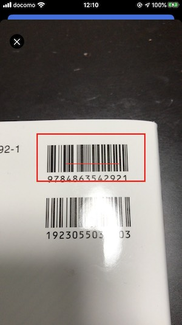

# @rdlabo/capacitor-codescanner
Capacitor CodeScanner is a native AdMob implementation for iOS.
__Now, This work at iOS only.__

| CodeType | Web |  iOS | Android |
|:-----------------:|:-----------------:|:-----------------:|:-----------------:|
| **aztec** | - | - | - |
| **code128** | - | - | - |
| **code39** | - | ◯ | - |
| **code39Mod43** | - | - | - |
| **detaMatrix** | - | - | - |
| **ean13** | - | ◯ | - |
| **ean8** | - | - | - |
| **face** | - | - | - |
| **code128** | - | - | - |
| **interleaved2of5** | - | - | - |
| **itf14** | - | - | - |
| **pdf417** | - | - | - |
| **qr** | - | ◯ | - |
| **upce** | - | - | - |
| **catBody** | - | - | - |
| **dogBody** | - | - | - |
| **humanBody** | - | - | - |
| **salientObject** | - | - | - |



## DONATE THIS PROJECT
Thanks for considering donate.

If this plugin help you, please share admob income. This help developing this plugin.This also help me easily determine how much time I would spend on the projects each month.

|  | TYPE | AMOUNT | LINK |
|:--:|:--:|:--:|:--:|
| PayPal.me | Once | Any | [Donate](https://www.paypal.me/rdlabo) |
| Paypal | Subscription | $15/month | [Donate](https://www.paypal.com/cgi-bin/webscr?cmd=_s-xclick&hosted_button_id=GE7XTRB3S6M4S) |
| Paypal | Subscription | $30/month | [Donate](https://www.paypal.com/cgi-bin/webscr?cmd=_s-xclick&hosted_button_id=ZV5NSRJ2MSMGN) |
| Paypal | Subscription | $50/month | [Donate](https://www.paypal.com/cgi-bin/webscr?cmd=_s-xclick&hosted_button_id=5RKVFKZRE8F36) |


## Installation
```
$ npm install --save @rdlabo/capacitor-codescanner
```

## How To Use
```typescript
import { Plugins } from '@capacitor/core';
const { CodeScanner } = Plugins;
import { ScannerOption } from '@rdlabo/capacitor-codescanner';

@Component({
  selector: 'app-root',
  templateUrl: 'app.component.html',
  styleUrls: ['app.component.scss']
})
export class AppComponent implements OnInit {
    constructor(){
        CodeScanner.addListener('CodeScannerCatchEvent', async (info: { code: string }) => {
            console.log(info.code); // Get Code
        });
    }

    openCodeScanner(){
        const option: ScannerOption = {
          detectionX: 0.2,
          detectionY: 0.35,
          detectionWidth: 0.6,
          detectionHeight: 0.15,
        };
        CodeScanner.present(option);
    }
}
```

## APIs
### present(): Promise<{ value: boolean }>
```typescript
CodeScanner.present(ScannerOption);
```

#### Event Listener
```typescript
addListener(eventName: 'CodeScannerCatchEvent', listenerFunc: (info: any) => void): PluginListenerHandle;
```

## Options
### ScannerOption
```ts
interface AdOptions {
  detectionX?: number;
  detectionY?: number;
  detectionWidth?: number;
  detectionHeight?: number;
}
```
